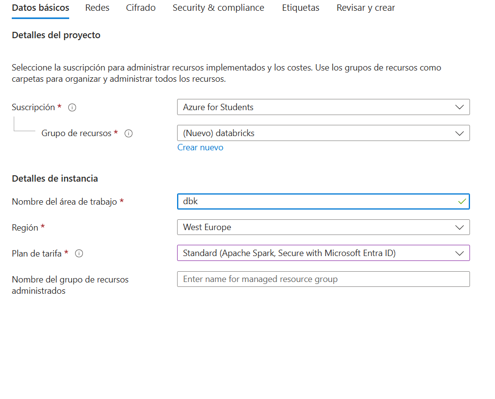
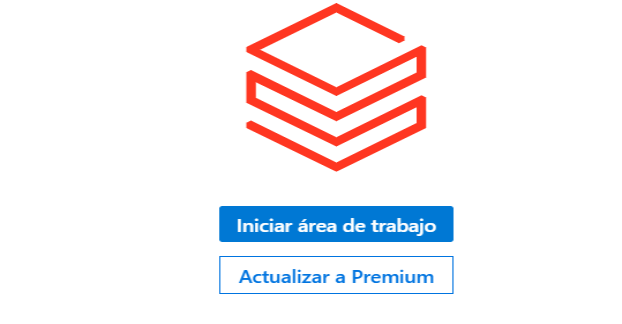
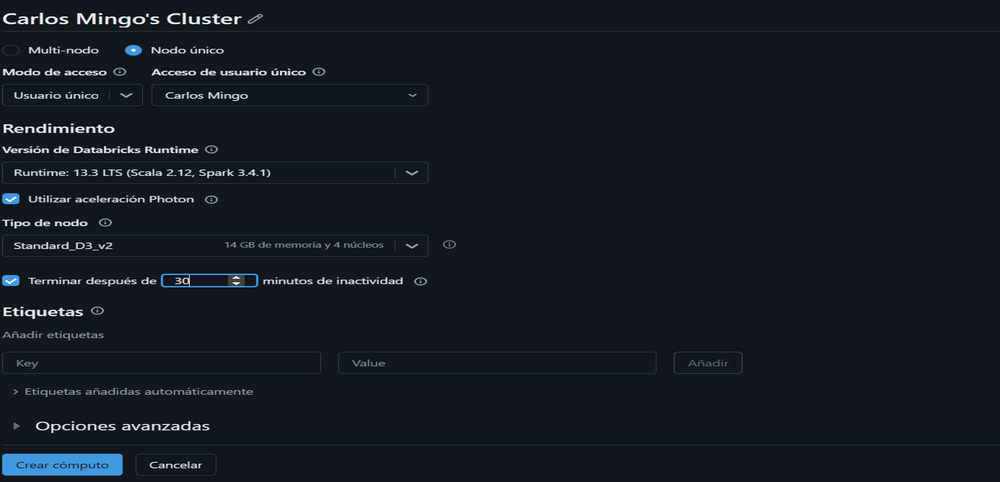
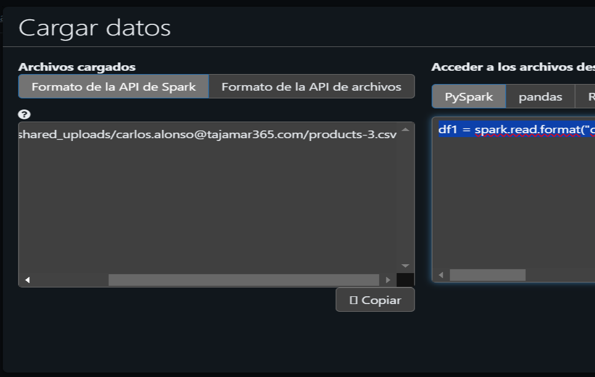
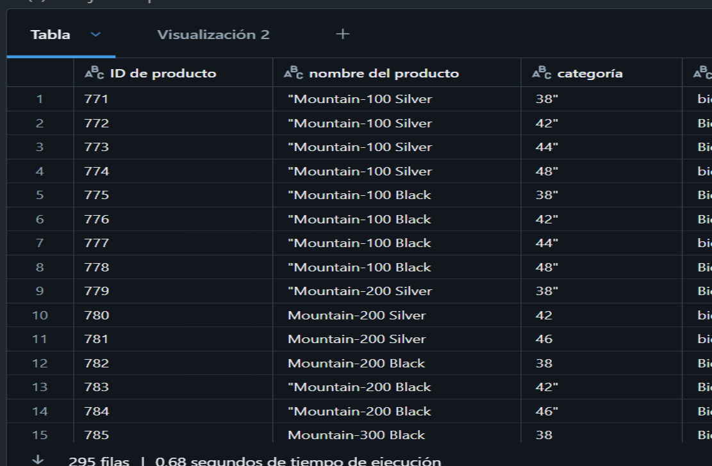

# Azure Databricks

Azure Databricks es una plataforma de análisis de datos unificada y abierta que permite crear, implementar, compartir y mantener soluciones de datos, análisis e inteligencia artificial a nivel empresarial y a gran escala. Se integra con el almacenamiento en la nube y la seguridad de su cuenta de Azure, gestionando e implementando la infraestructura en la nube en su nombre.

## Paso 1: Creación de un área de trabajo de Azure Databricks

1. Buscamos Databricks y creamos un area de trabajo con esta configuracion:



2. Una vez creado vamos al recurso e iniciamos el área de trabajo(esto nos llevara a la interfaz Databricks):



## Paso 2: Creacion de un cluster de Spark en databricks

1. vamos a cluster(cómputo) y crear cluster(crear cómmputo) y usaremos esta configuración(Tarda un rato en levantarse):



## Paso 3: Usar Spark

1. Vamos a workspace > shared 
2. Dentro de shared creamos un cuaderno: Crear > Cuadernos

3. Ahora carguemos products.csv a databricks en Archivo > Cargar datos al DBFS... 


Pulsamos en siguiente y guardamos el codigo de la derecha con pySpark seleccionado:



4. Pegando ese codigo convertimos nuestro csv en un dataframe gestionable para Spark.

(Hay que sustituir parametros si copias este)
```
df1 = spark.read.format("csv").option("header", "true").load("dbfs:/FileStore/shared_uploads/user@outlook.com/products.csv")
```
5. Luego podemos usar para visualizarlo
```
display(df1)
```

## Cosas variadas que podemos hacer

### Usar diferentes tipos de visualización como tablas o graficos




### Crear tablas y hacer consultas

1. Creamos una nuvea celda e ingresamos(esto limpia el csv para caracteres no validos y crea una tabla)

```
# Rename columns to remove invalid characters
df1 = df1.toDF(*[c.replace(' ', '_').replace(',', '_').replace(';', '_').replace('{', '_')
                 .replace('}', '_').replace('(', '_').replace(')', '_').replace('\n', '_')
                 .replace('\t', '_').replace('=', '_') for c in df1.columns])

# Save the DataFrame as a table
df1.write.saveAsTable('products')
```
2. tras ahaber creado la tabla, creamos una nueva celda(aqui usaremos sql) Tambien podremos crear visualizaciones

```
%sql

SELECT *
FROM products

```